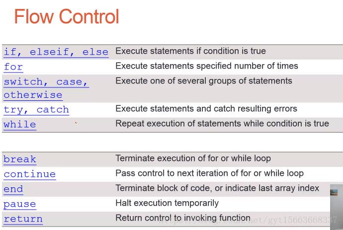
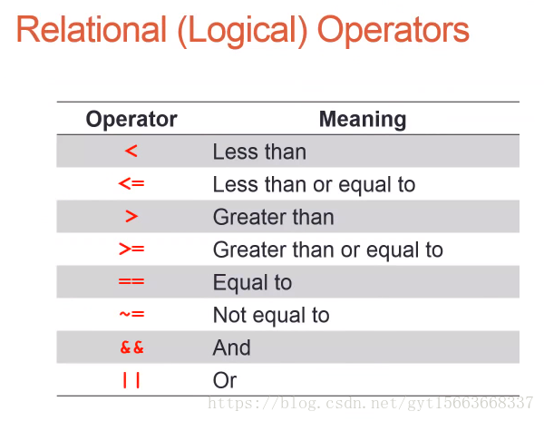
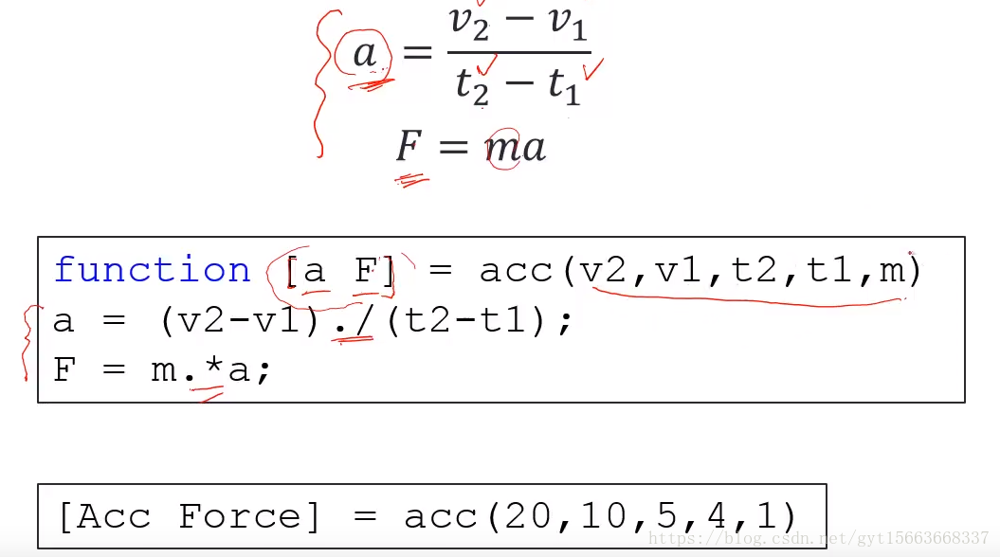

## MATLAB Script：

一个文件包含一系列matlab命令
类似于c/c++程序
脚本保存为<file>.m文件，这样就可以运行这样以.m结尾的matlab脚本
使用技巧：

注释：% 注释文字
分区块：%% 一个区块，使用运行的时候会运行整个文件，使用运行节会只运行当前区块。
断点调试：在程序代码行前面点击会出现一个圆圈表示断点，当运行程序时，程序会停在此处。
代码缩进排版：ctrl + I
执行顺序：代码是从上到下执行的

### 分支控制

break语句; 用在循环语句中，用来终止循环。

结构化程序的技巧：

编写脚本程序代码之前，可以使用
clear all; 清除之前使用过的变量
close all; 关闭所有的figure 
使用“；”在命令行的结尾，不让命令执行
使用“...”将代码换行输入。使代码不过于全部在一行
ctrl + C：提前截至运行的程序 

### 函数

关键字：function

函数名和文件名要相匹配

目录：matlab需要找到这个函数

输入和输出变量是可选的

本地变量：dim和flag不是被接受的 

## 变量与数据存储

目标：
变量：string,structure,cell
数据存储
一、变量 
uint8的含义：

u：无符号的意思
int：整形
8：bit，8bit

**字符串**
String

变量：char（一个字符）

将字符放在单引号中

一个字符在ASCii中使用0-255来表示

变量：string（多个字符）

用单引号将一串字符包起来，就是字符 s1 = 'examplt';

字符串合并：s3 = [s1 s2]

逻辑操作：

判断相应位置是否为a  ‘a' == str，对str中的每个字符比较

替换字母a   str(str == 'a') = 'Z' ：找到str中等于a的位置，并替换成Z

注意：一个等号是赋值，两个等号是判断。

### cell:

存储各种各样的数据

存储类是于一个矩阵，但是每个实体包含不同的数据类型

使用 {} 

读取cell array

A（1，1）：产看一个cell

A{1,1}：查看矩阵内容

A{1, 1}(2，2)：查看矩阵的具体一个元素

创建一个cell:

## 数据存取
save('student.mat', "student")
>> load('student.mat')