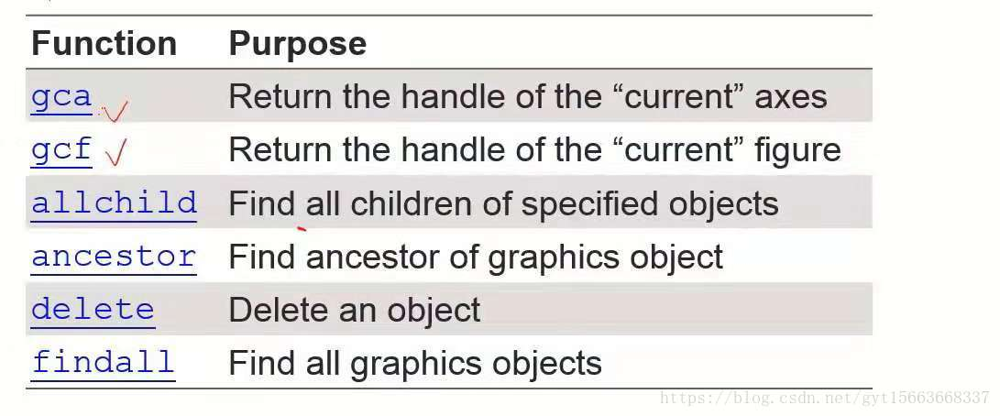
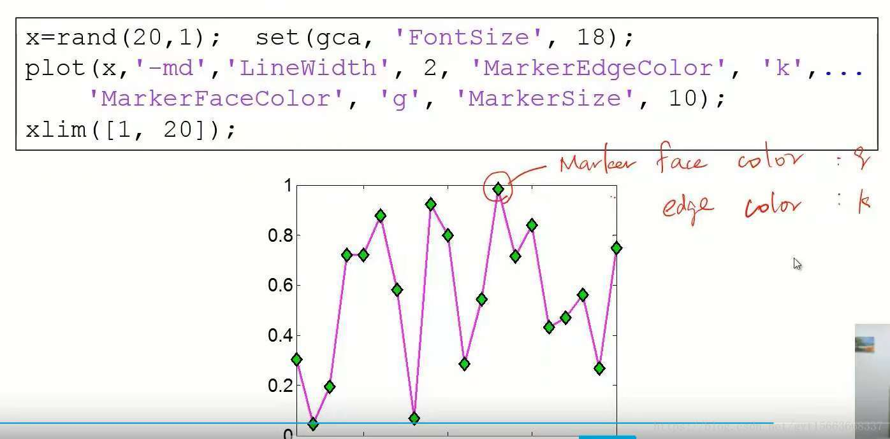
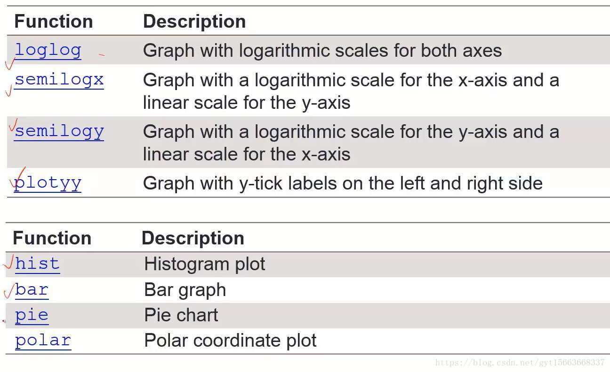

目标：
基础绘图
绘图的物件
## 一、基础绘图
plot()函数：

plot(x, y)：根据坐标（x，y）画出图形
plot(y)：只给出y，这样画图的时候，x轴就是x=[1...n], n = length(y)
但我们想要在画布上使用两个plot()时。第二个图形会覆盖第一个
hold on/off:

作用：在一个画布上，画多个图形

二、绘图物件
matlab画图包含的结构：

Figure object：画布

Axes object：坐标轴

Line object：图形

Text object：文本

Surface object

...

Figure Adjustment:

几个特性:

字体

字体大小

线的宽度

坐标限制

tick positon(刻度位置)

tick labe

 Modifying Properties of An Object(修改绘图物件)

策咯：

找到物件的handle，每一个object都有一个handle

读取或改变物件的特性

1.identifying the handle of an object：获取对象的handle

Upon creation

h = plot(x,y); 直接获取画线的handle

Utility functions：

2.Fetching or Modigying Properties：取出或者改变物件

get object properties(获取物件的特性)：get()

setting axes limits(设置坐标轴的限制)：set()

set(gca, 'XLim', [0, 2*pi]);

setting font and tick of axes(改变坐标轴的字体大小，刻度）

set(gca, 'FontSize', 25);

set(gca, 'XTick', 0:pi/2:2*pi);

set(gca, 'XTickLabel', 0:90:360);

Line Specification(线的特性)

line style and width(线的风格和宽度)

set(h,'LineStyle','-.','LineWidth',7.0,'Color','g');

Marker specification(线上标记的特性）

face and edge colors of the markder

Multiple Figures(多个画布）：

呼叫figure创建一个figure窗口。

当使用gcf 获取handel时要小心，存在多个figures。

## 画2D图

1. Logarithm Plots：关于对数函数的画图

semilogx()：对x轴取log
semilogy()：对y轴取log
loglog()：对x轴和y轴都取log

